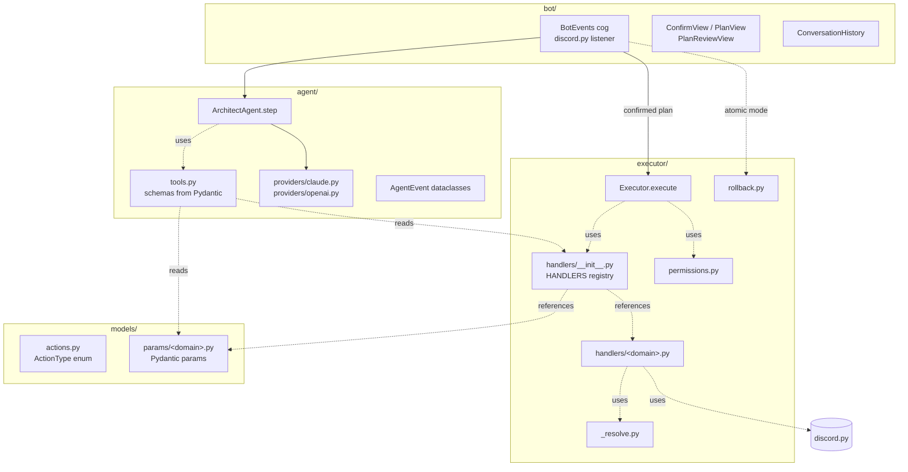
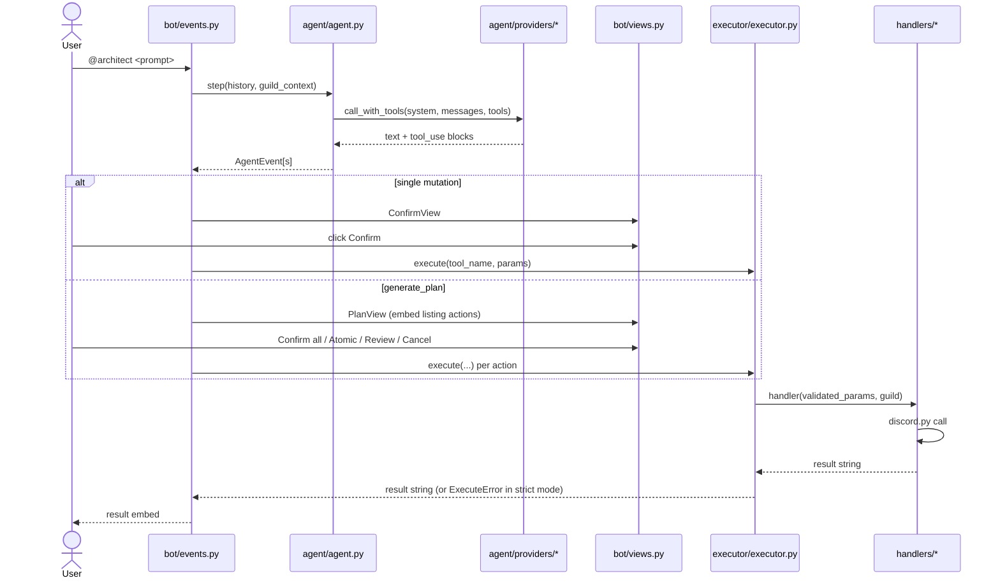

# Architecture

## Layers



The dependency rule is one-way: `bot/` → `agent/` → `executor/` →
`models/` → `discord.py`. The bot layer never imports `discord.py`'s
mutation methods directly — it delegates to the executor.

## Request lifecycle



## The handler registry

`executor/handlers/__init__.py` exposes a single dict:

```python
HANDLERS: dict[str, HandlerSpec] = {
    "create_text_channel": HandlerSpec(
        handler=channels.create_text_channel,
        params_model=CreateTextChannelParams,
        required_permission="manage_channels",
    ),
    ...
}
```

`Executor.execute` reads it to validate parameters, gate on
permissions, and dispatch. `agent/tools.py` reads the same dict to
generate the JSON Schema sent to the LLM. They cannot drift apart.

## Adding a new `ActionType`

The end-to-end recipe — the same five-step pattern every existing
action follows — is:

1. **Enum**: add the action name to `ActionType` in
   `src/architect/models/actions.py`.
2. **Params model**: define a Pydantic model in the right
   `src/architect/models/params/<domain>.py`. Use
   `model_config = ConfigDict(extra="forbid")` and
   `Field(description=...)` on every field.
3. **Handler**: write `async def <action>(params: <Model>, guild) -> str`
   in `src/architect/executor/handlers/<domain>.py`. Use the helpers
   in `_resolve.py` for name/ID lookups.
4. **Register**: add the entry to the appropriate group in
   `executor/handlers/__init__.py` and, if it's a mutation, add the
   required permission to `executor/permissions.py`. If the action
   has a deterministic inverse, also add a row to
   `executor/rollback.py` so atomic mode can roll it back.
5. **Test**: add unit tests under `tests/handlers/<domain>.py`. Cover
   the happy path plus the documented error cases. Update the param
   tests in `tests/models/test_params.py` if the model has non-trivial
   validation.

That's it — `tools.py`, `Executor`, the LLM prompt and the JSON Schema
all pick up the new action automatically.

## Design decisions

**Whitelist-only.** Every action passes through the `ActionType` enum
and its dedicated Pydantic model. The agent has no escape hatch — it
cannot smuggle a free-form Discord call past the registry. Adding a
new capability is a code change, not configuration.

**Stateless.** No database, no per-server preferences, no learning.
Configuration lives in env vars; runtime state lives in conversation
history kept in memory per channel. Restarting the bot loses
conversational context but never breaks Discord state.

**No retries on LLM errors.** If a provider call fails we surface the
error to the user instead of silently retrying. Hidden retries hide
quota issues and produce surprising costs; we'd rather the user see
the failure and act.

**Mutations always confirmed.** Even with the "Confirm all" button,
the user sees the full plan first. Destructive actions (`delete_*`)
go through the same flow as creations — there's no "auto-confirm
delete" mode. Atomic mode lets the user opt into rollback semantics
when they want them.

**JSON Schemas generated from Pydantic, not hand-maintained.** Before
this refactor the LLM-facing schema lived in `agent/tools.py` as 670
lines of hand-written JSON. Any drift between schema and runtime
validation was a bug waiting to happen. Now both come from the same
Pydantic models — change a field once, propagate everywhere.

## What we deliberately don't do

- No persistent logs of user prompts (only the structured event log).
- No "admin free-text" mode — every mutation is whitelisted.
- No feature flags or runtime config — change the code, bump the
  version. The whole project is small enough that this is cheaper
  than a flag system.
- No silent rollback. Atomic mode is opt-in; the failure plus the
  rollback outcome are both reported.
