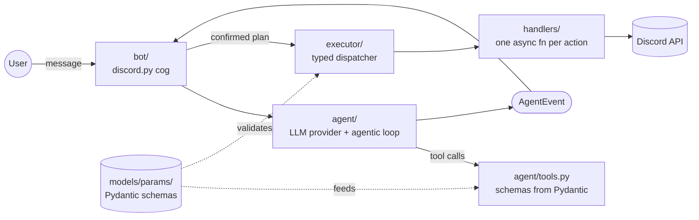

# ai-discord-architect

[](https://github.com/sycatle/ai-discord-architect/actions/workflows/ci.yml)
[](./pyproject.toml)
[](https://www.python.org/)
[](https://github.com/astral-sh/ruff)
[](http://mypy-lang.org/)
[](LICENSE)

Discord bot driven by an AI agent. Describe what you want in natural
language; the bot turns the request into a typed JSON plan, shows you
exactly what it will do, and only mutates Discord after explicit
confirmation.

```text
@architect Create 3 gaming channels with the Player and Moderator roles
@architect Add an AutoMod rule that blocks shortened links
```

## How it works

1. **Generate** — the agent (Claude or OpenAI) translates the request
   into a typed JSON plan via tool calling. Schemas are generated
   from Pydantic models, so the LLM and the runtime validation share
   a single source of truth.
2. **Preview** — a Discord embed lists every action before any
   mutation.
3. **Confirm** — `Confirm all`, `Atomic` (rolls back automatically if
   any action fails), `Review` (action-by-action), or `Cancel`.
4. **Execute** — the executor dispatches each action through a typed
   handler, pre-checks the bot's permission, and surfaces Discord
   errors as readable messages (never a stack trace in chat).

No Discord mutation ever happens without human approval.

## Capabilities

The bot drives most of the Discord guild API — 27 mutation actions
plus 9 read-only inspection tools, all whitelisted through an
`ActionType` enum:

| Domain | Actions |
|---|---|
| **Channels** | text, voice, forum, stage, categories, edit, delete, permissions, invites, webhooks |
| **Roles** | create, edit, delete, assign / unassign on members |
| **Members** | edit (nickname, mute, deafen, timeout, voice-channel move) |
| **Scheduled events** | create, edit, delete (voice / stage / external) |
| **AutoMod** | rule create / edit / delete (keyword, spam, mention spam, presets) |
| **Server settings** | name, locale, verification, content filter, system / rules / updates / safety channels, community mode, welcome screen |

The agent can also **read** the server state (channels, roles,
members, invites, webhooks, events, AutoMod) before proposing a plan,
**check the bot's own Discord permissions**
(`check_bot_permissions`) to avoid plans that will fail at execution
time, and ask for clarifications when the request is ambiguous.

## Architecture



Each layer only knows the layer below it. The `bot/` layer never
touches the Discord API directly — it delegates to `executor/`. The
single `HANDLERS` registry under `executor/handlers/` is the source
of truth for both runtime dispatch and the JSON Schema sent to the
LLM.

See [ARCHITECTURE.md](ARCHITECTURE.md) for the request lifecycle, the
trade-offs we made, and the steps to add a new `ActionType`.

## Observability

Key events (`plan_generated`, `plan_executed`, `action_failed`, etc.)
are emitted as structured JSON Lines to `data/architect.jsonl` (10 MB
rotation, 5 backups). In production: `tail -f data/architect.jsonl |
jq` to follow, or `grep '"event":"plan_executed"'` to filter.

## Stack

Python 3.12 · uv · discord.py 2.x · Pydantic v2 · Anthropic / OpenAI
SDKs

## Quick start

```bash
git clone https://github.com/sycatle/ai-discord-architect
cd ai-discord-architect
uv sync
cp .env.example .env  # fill DISCORD_TOKEN, DISCORD_GUILD_ID, LLM_API_KEY
uv run architect
```

See [SETUP.md](SETUP.md) for Discord application setup, OAuth scopes,
and required permissions.

## Tests

```bash
uv run pytest
```

303 tests covering the handler registry, executor error paths,
AutoMod / events / server / channels / roles / members handlers,
LLM-provider translation layers (Claude + OpenAI), Discord UI views,
and the agentic loop. Branch coverage gate at 90% in CI.

## Contributing

PRs welcome. See [CONTRIBUTING.md](CONTRIBUTING.md) for the dev
setup, the guide to add a new `ActionType`, and the conventions
enforced by CI (ruff, mypy strict, pytest, coverage).

## License

MIT — see [LICENSE](LICENSE).
